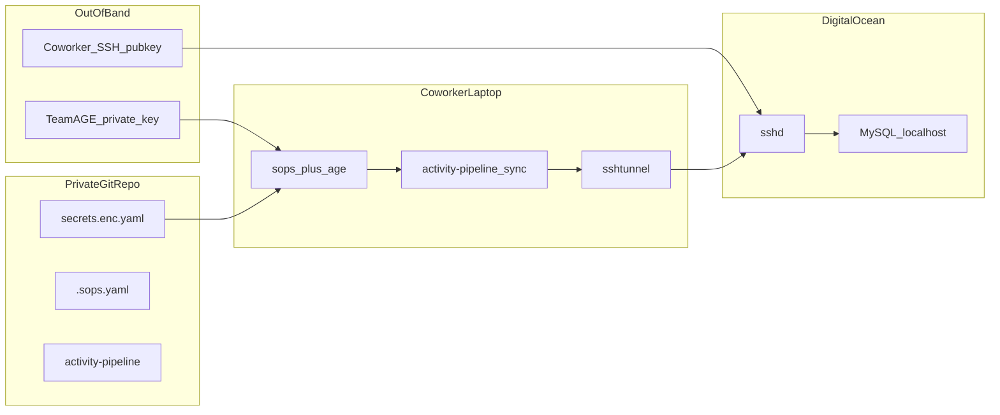

# SOPS+AGE Shared Secrets for Team Package

## Overview

Integrate a shared-team AGE + SOPS secrets file into activity-pipeline so coworkers can clone the private repo, install with uv, decrypt team secrets locally, and SSH-tunnel to the droplet MySQL to run the sync CLI.

## Direct answers

- **Can you ship the YAML with the package?** Yes. Commit the **encrypted** file (`secrets/secrets.enc.yaml`) in the private git repo. Editable installs (`uv sync` / `uv pip install -e .`) keep it on disk next to the project; load it by path from the repo root (not by inventing a second secrets channel).
- **Do coworkers need an AGE private key?** Yes — the **shared team** AGE private key, delivered **out of band** (1Password, Signal, etc.), never via git or the package. They do **not** need your personal AGE key. Each person still uses **their own SSH key** for the tunnel (you only add their public SSH key to the droplet).

## Architecture

## Chosen defaults

| Decision | Choice |
|----------|--------|
| AGE model | One shared team identity; public key in `.sops.yaml`; private key only via OOB + `SOPS_AGE_KEY_FILE` |
| Distribution | Private git clone + **uv** editable env |
| Secrets in package | Encrypted YAML in repo; loaded at CLI start via `sops -d` |
| SSH | Per-user key at a **fixed path** `~/.ssh/activity_pipeline_droplet` (documented); path stored in encrypted YAML as that convention so one shared secrets file works for everyone |
| DB creds | Shared team MySQL users/passwords inside the encrypted YAML |
| Tunnel | In-process `sshtunnel` before `mysql.connector.connect`; point connector at `127.0.0.1` + local bind port |

## Implementation todos

- [ ] Add `.sops.yaml`, `secrets.example.yaml`, `secrets.enc.yaml`, gitignore rules for AGE keys and decrypted files
- [ ] Implement `secrets.py` (`sops -d`), wire `src_creds` / `tgt_creds` / CLI; remove dotenv secret path
- [ ] Add `sshtunnel` context manager and wrap sync so MySQL uses `127.0.0.1` + local bind port
- [ ] Update pyproject deps for uv (`sshtunnel`, drop dotenv); lock with uv; document `uv sync`
- [ ] Document maintainer + coworker onboarding (AGE OOB, SSH key path, `uv run sync`)

## Repo / package changes

1. **Secrets layout**
   - Add `.sops.yaml` with `creation_rules` for `secrets/.*\.enc\.yaml$` using the team AGE public key only.
   - Add `secrets/secrets.example.yaml` (plaintext template) and `secrets/secrets.enc.yaml` (encrypted, committed).
   - YAML sections: `ssh` (host, user, `private_key_path: ~/.ssh/activity_pipeline_droplet`, mode), `source_db`, `target_db` (host/port/user/password/database).
   - `.gitignore`: never commit `keys.txt`, `*.agekey`, decrypted copies, or `.env` secrets.

2. **`src/pipeline/secrets.py`**
   - Resolve `SECRETS_FILE` or default to repo-root `secrets/secrets.enc.yaml`.
   - Decrypt with `subprocess`: `sops -d --output-type json <file>`; parse JSON; cache in-process.
   - Fail fast if `sops` missing or AGE key cannot decrypt.
   - Do not dump secrets into `os.environ`.

3. **Wire credentials**
   - Change `src_creds()` and `tgt_creds()` to read from `load_secrets()`.
   - Remove production reliance on `python-dotenv` / `.env` in `__init__.py`.
   - Call `load_secrets()` once at the start of `cli.main()`.

4. **SSH tunnel module**
   - Add `src/pipeline/ssh_tunnel.py` using `sshtunnel.SSHTunnelForwarder` with secrets from the `ssh` section; remote bind `127.0.0.1:3306` (or ports from YAML if source/target differ — if both DBs are on the droplet localhost, one tunnel and both connectors use the local bind port with host overridden to `127.0.0.1`).
   - Context manager wrapping the sync path so tunnel lifetime covers query + import.

5. **uv packaging**
   - Keep `[project] name = "activity-pipeline"`; add deps: `mysql-connector-python`, `sshtunnel`, `PyYAML` (or JSON-only from `sops -d`); drop `python-dotenv` for secrets.
   - Add `uv.lock` via `uv lock`; document `uv sync` as the install path.
   - Ensure package data discovery stays `where = ["src"]`; secrets stay as **repo files**, not wheel-only data (editable clone is the distribution model).

6. **Docs**
   - README section: maintainer key rotation, coworker onboarding (below), droplet `authorized_keys` checklist.
   - Short `docs/coworker-setup.md` with the exact steps in the summary below.

## Maintainer setup (you, once)

1. `age-keygen -o` team key; store private key in team secret store; put public `age1…` in `.sops.yaml`.
2. Encrypt current DB + SSH host/user/path into `secrets/secrets.enc.yaml`.
3. On droplet: add each coworker’s SSH **public** key to `appuser` (or tunnel user) `authorized_keys`; ensure MySQL is localhost-only.
4. Grant teammates private repo access; send team AGE private key OOB; tell them the SSH key filename convention.

## Coworker steps (summary for them)

1. **Install tools:** `uv`, `sops`, `age` (e.g. Homebrew on macOS).
2. **Clone** the private repo; `cd` into it; run `uv sync` (editable env + CLI entry point).
3. **Receive OOB:** team AGE private key file — save to e.g. `~/.config/sops/age/keys.txt` and export `SOPS_AGE_KEY_FILE` to that path (shell profile).
4. **SSH:** generate or use an existing key; save private key as `~/.ssh/activity_pipeline_droplet` (`chmod 600`); send you the **public** key so it can be installed on the droplet.
5. **Verify decrypt:** `sops -d secrets/secrets.enc.yaml` prints YAML (proves AGE setup).
6. **Run sync:** `uv run activity-pipeline sync --start YYYYMMDD --end YYYYMMDD` (tunnel opens, MySQL over localhost forward, insert runs). Use `--dry-run` first if desired.
7. **Do not** commit the AGE private key, decrypted YAML, or their SSH private key.

## Verification

- Fresh clone + team key only → decrypt works; without key → clear failure.
- Sync from a second machine with that user’s SSH key → tunnel + insert succeed.
- Existing unit tests monkeypatch `load_secrets()`; no dependency on real AGE in CI.
